# All Project Report Figures (White Background Compatible)

This file contains all the diagrams from `project_report.tex`, redrawn in the correct order to be compatible with a white background.

---

## Figure 1: Technology Stack Architecture

*Corresponds to `Diagrams_Figures/15.png` in the report.*

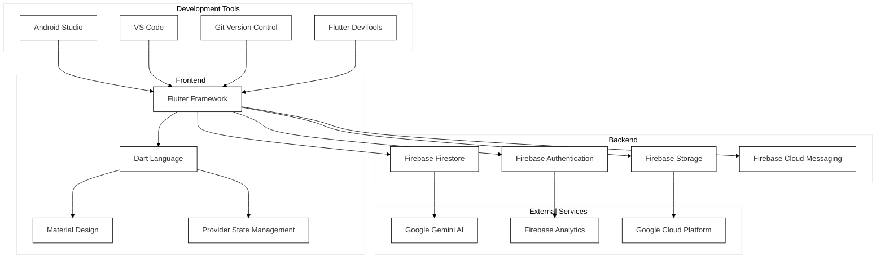

---

## Figure 2: Authentication flow

*Corresponds to `Diagrams_Figures/16.png` in the report.*

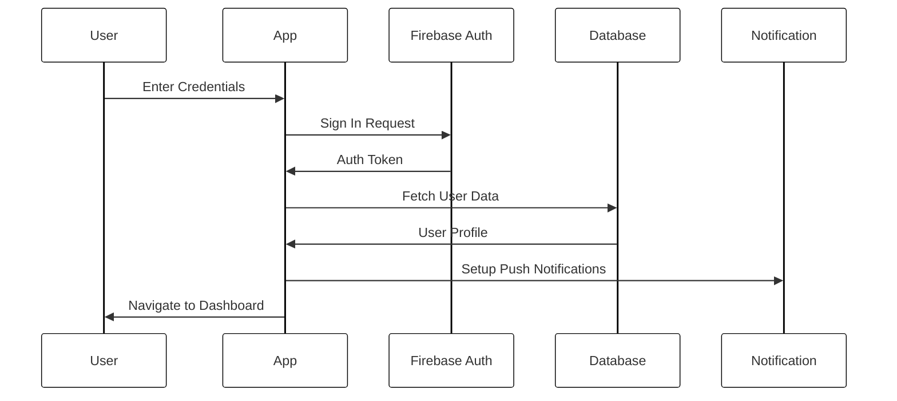

---

## Figure 3: Real-time data synchronization flow

*Corresponds to `Diagrams_Figures/17.png` in the report.*

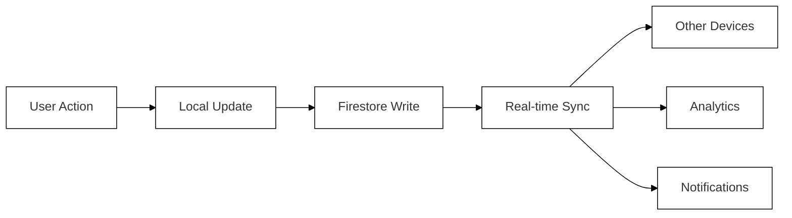

---

## Figure 4: Comprehensive testing strategy

*Corresponds to `Diagrams_Figures/18.png` in the report.*

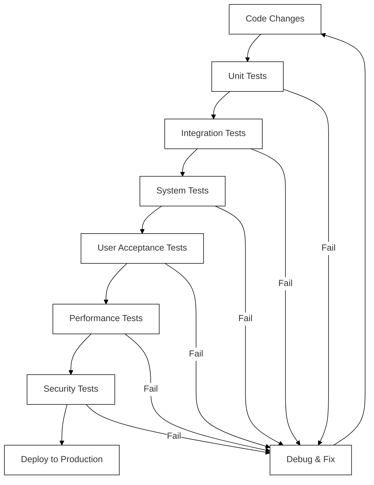

---

## Figure 5: Continuous Integration and Continuous Deployment pipeline

*Corresponds to `Diagrams_Figures/19.png` in the report.*

```mermaid
%%{init: {'theme': 'base', 'themeVariables': { 'primaryColor': '#ffffff', 'primaryBorderColor': '#000000', 'lineColor': '#000000'}}}%%
graph LR
    A[Code Commit] --> B[Git Repository]
    B --> C[Automated Tests]
    C --> D[Build Process]
    D --> E[Code Review]
    E --> F[Staging Deployment]
    F --> G[Manual Testing]
    G --> H[Production Deployment]
    H --> I[App Store Release]
```

---

## Figure 6: Multi-platform deployment architecture

*Corresponds to `Diagrams_Figures/20.png` in the report.*

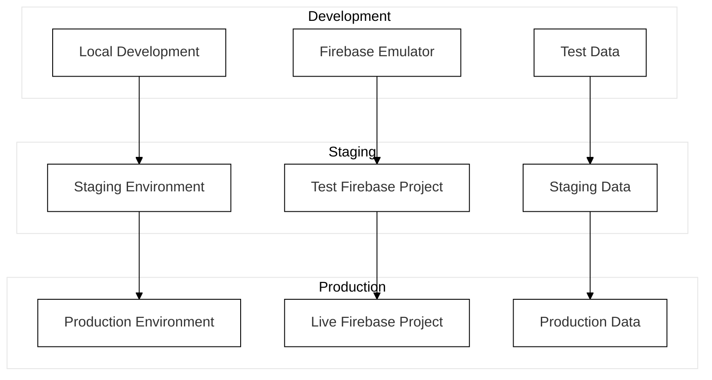

---

## Figure 7: Environment configuration management

*Corresponds to `Diagrams_Figures/21.png` in the report.*

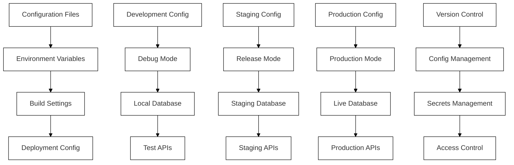

---

## Figure 8: Release management workflow

*Corresponds to `Diagrams_Figures/22.png` in the report.*

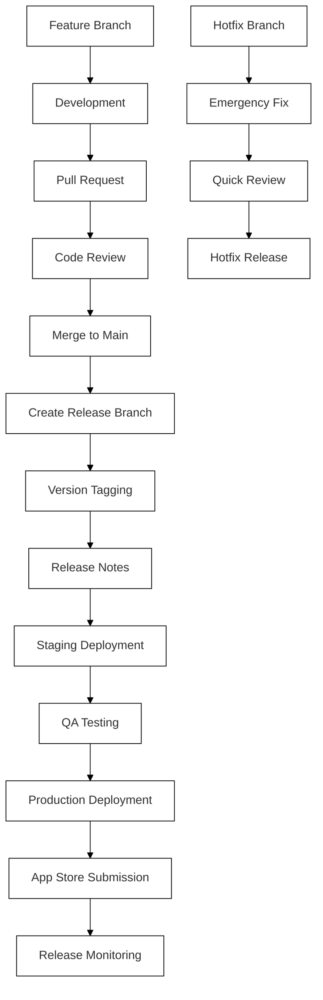

---

## Figure 9: Response time for critical user interactions

*Corresponds to `Diagrams_Figures/23.png` in the report.*

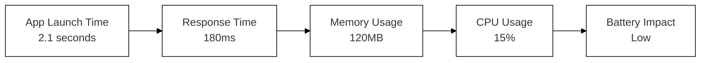

---

## Figure 10: User engagement metrics

*Corresponds to `Diagrams_Figures/24.png` in the report.*

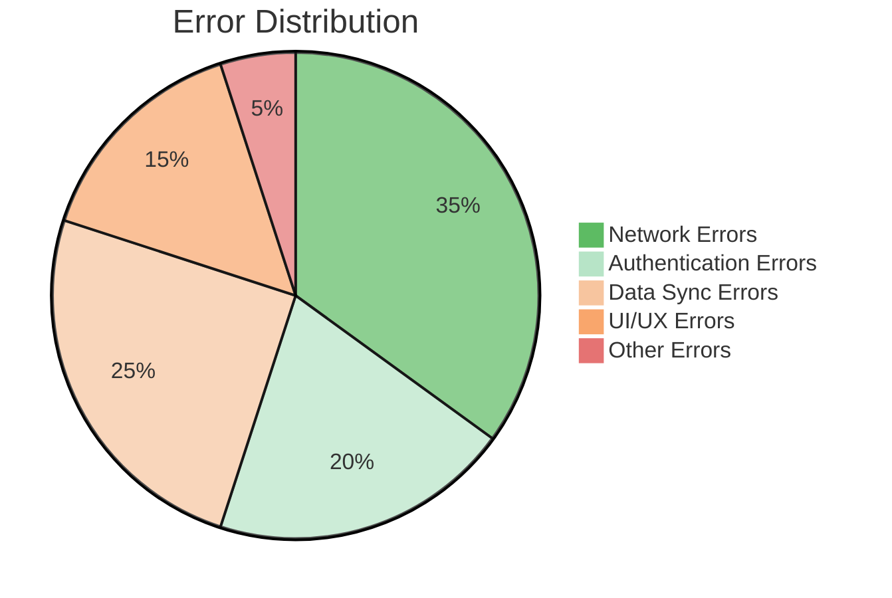

---

## Figure 11: Technology Evolution Roadmap

*Corresponds to `Diagrams_Figures/25.png` in the report.*

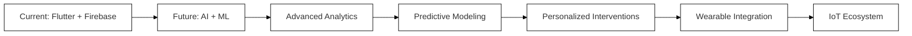

---

## Figure 12: Security measures implemented to protect user data

*Corresponds to `Diagrams_Figures/26.png` in the report.*

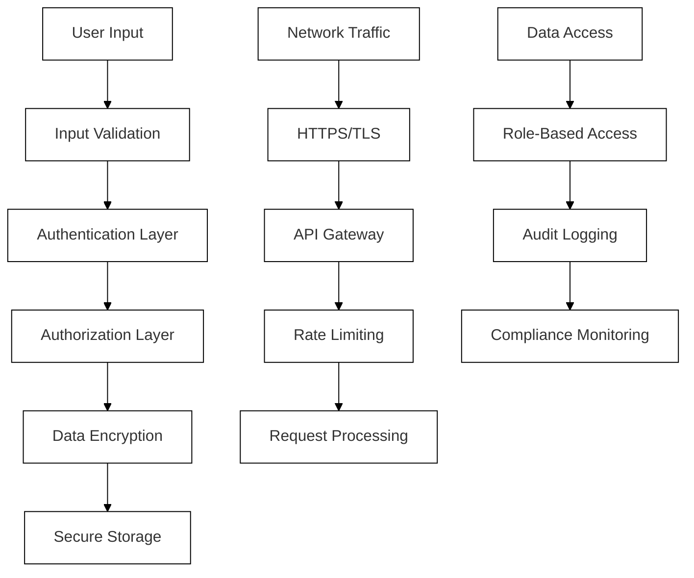

---

## Figure 13: High-Level Architecture of the SEE App

*Corresponds to `Diagrams_Figures/27.png` in the report.*

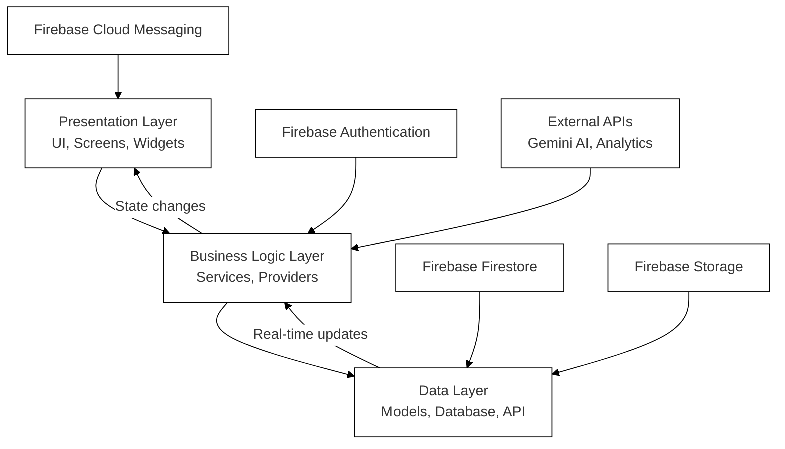

---

## Figure 14: System Usability Scale (SUS) Scores

*Corresponds to `Diagrams_Figures/28.png` in the report.*

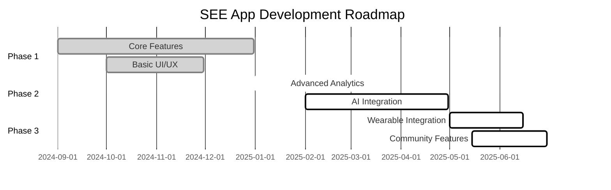