# SEE App Project Diagrams

This file contains all the Mermaid diagrams referenced in the PROJECT_REPORT.md file.

---

## Chapter 4: PROJECT DESIGN

### 4.2 System Architecture

#### Overall System Architecture
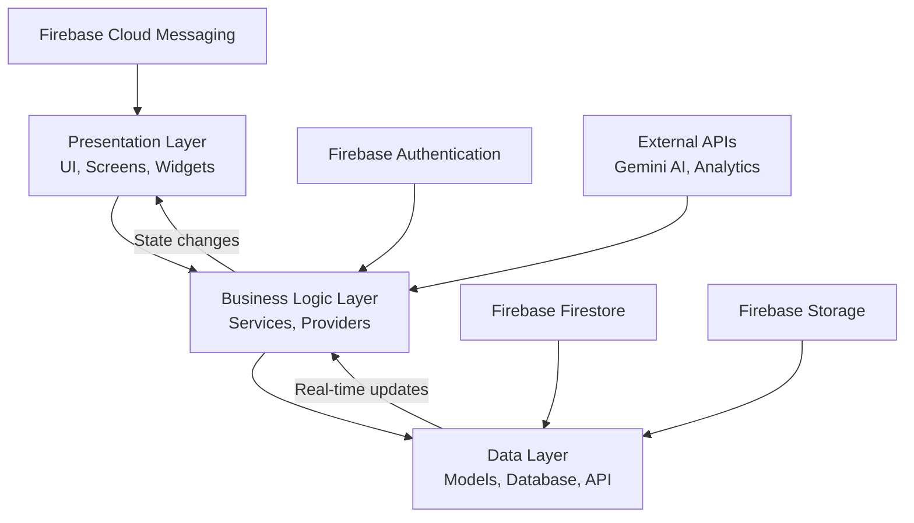

#### Detailed Component Architecture
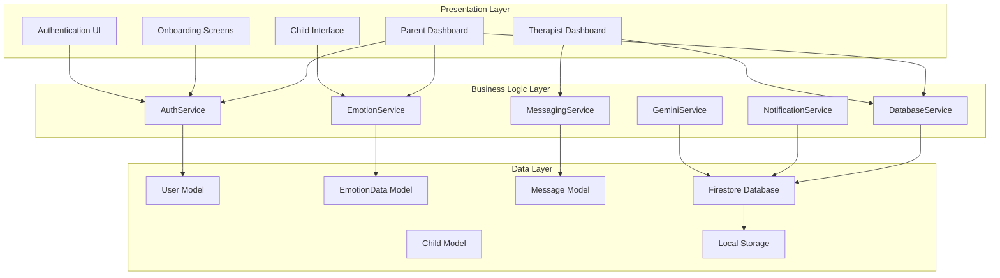

### 4.4 Detailed Component Design

#### User Model Component
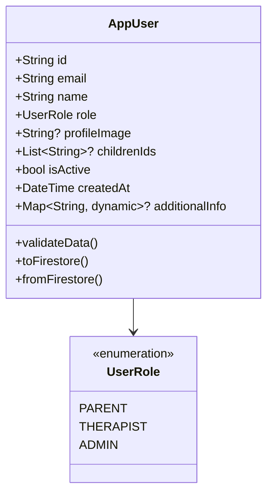

#### Emotion Service Component
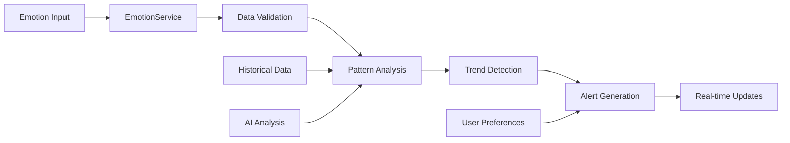

#### Database Service Component
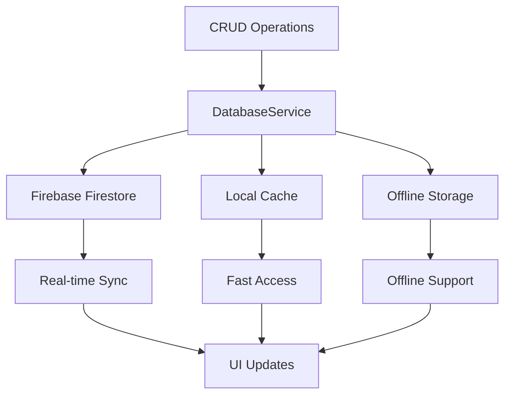

#### Authentication Service Component
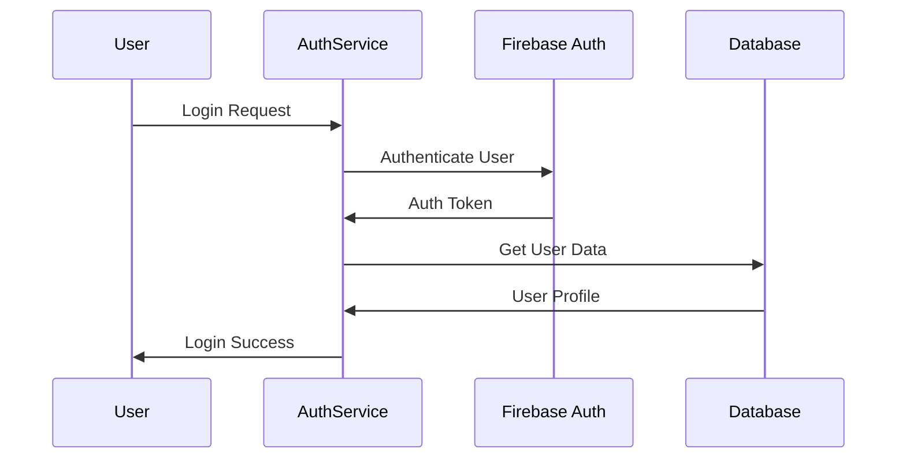

### 4.5 UI/UX Design

#### User Persona Relationships
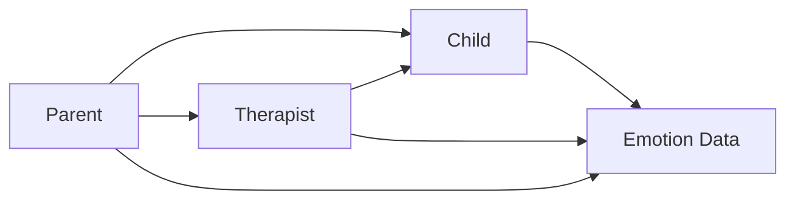

#### User Journey Map - Parent
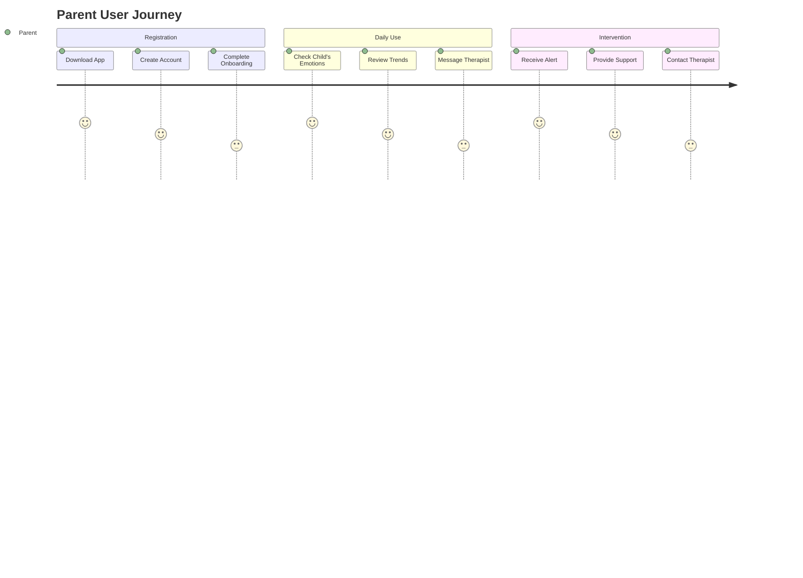

### 4.6 Workflow Design

#### User Registration Workflow
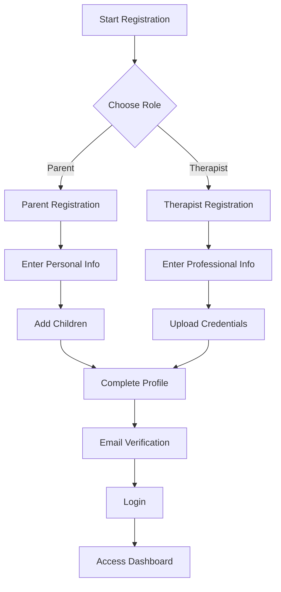

#### Emotion Tracking Workflow
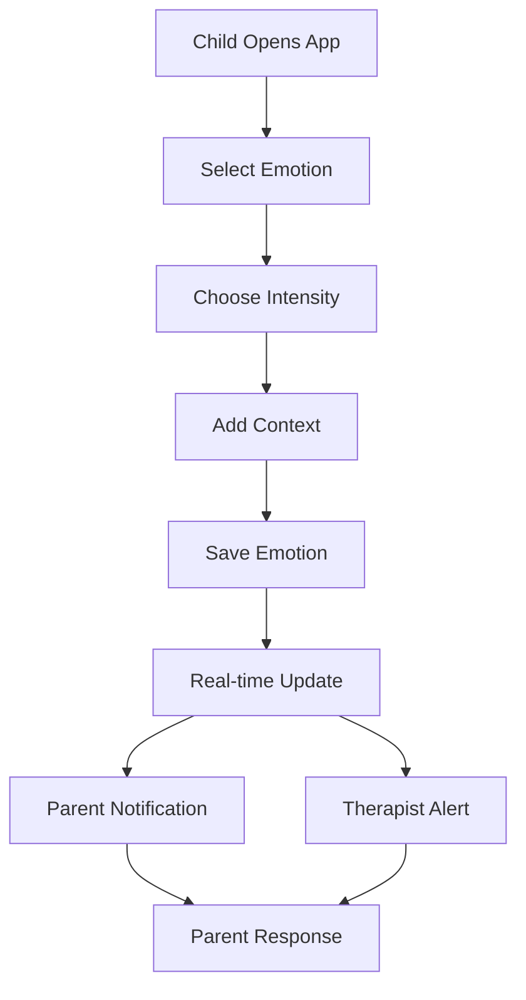

#### Therapist-Client Connection Workflow
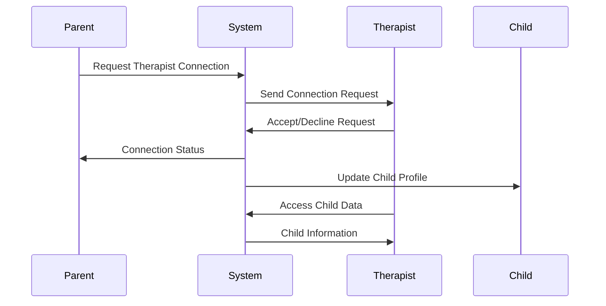

### 4.7 Database Design

#### Entity-Relationship Diagram (ERD)
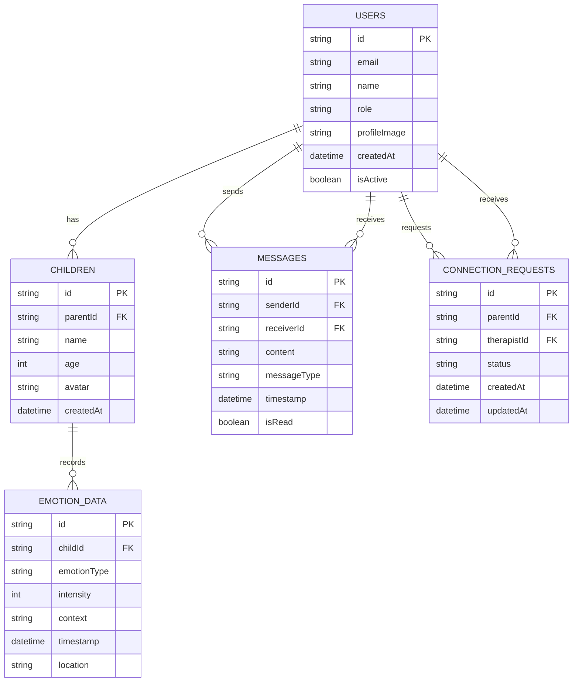

#### Firestore Collection Structure
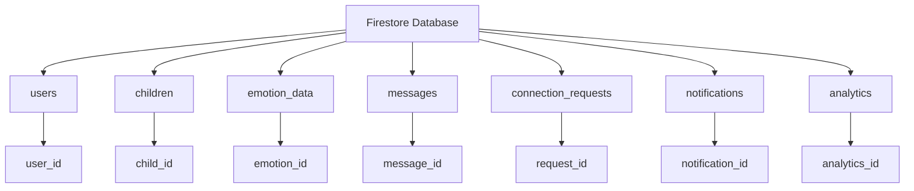

#### Security Rules Flowchart
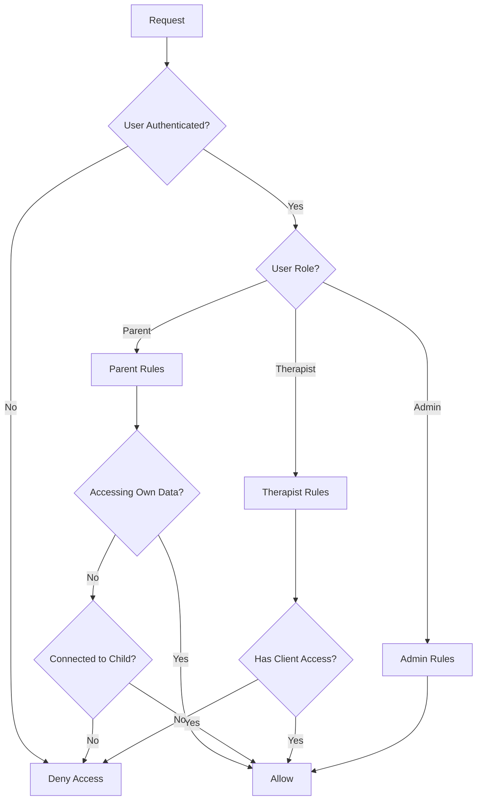

---

## Chapter 5: IMPLEMENTATION

### 5.2 Tools, Technologies, and Frameworks

#### Technology Stack
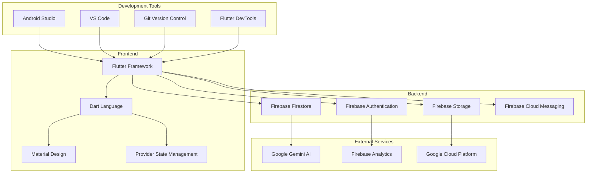

### 5.4 Key Implementation Details

#### Authentication Flow
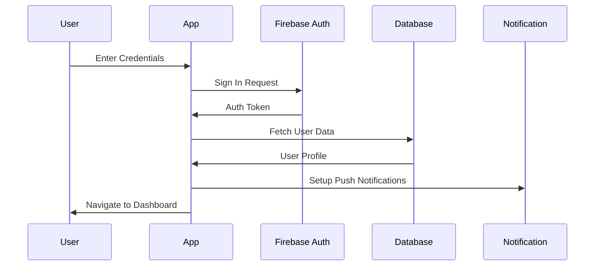

#### Real-time Data Flow
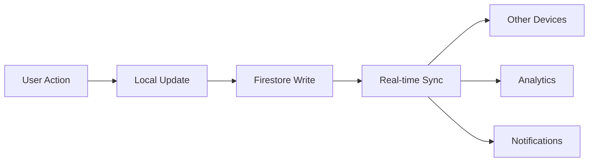

### 5.6 Testing and Debugging

#### Testing Strategy
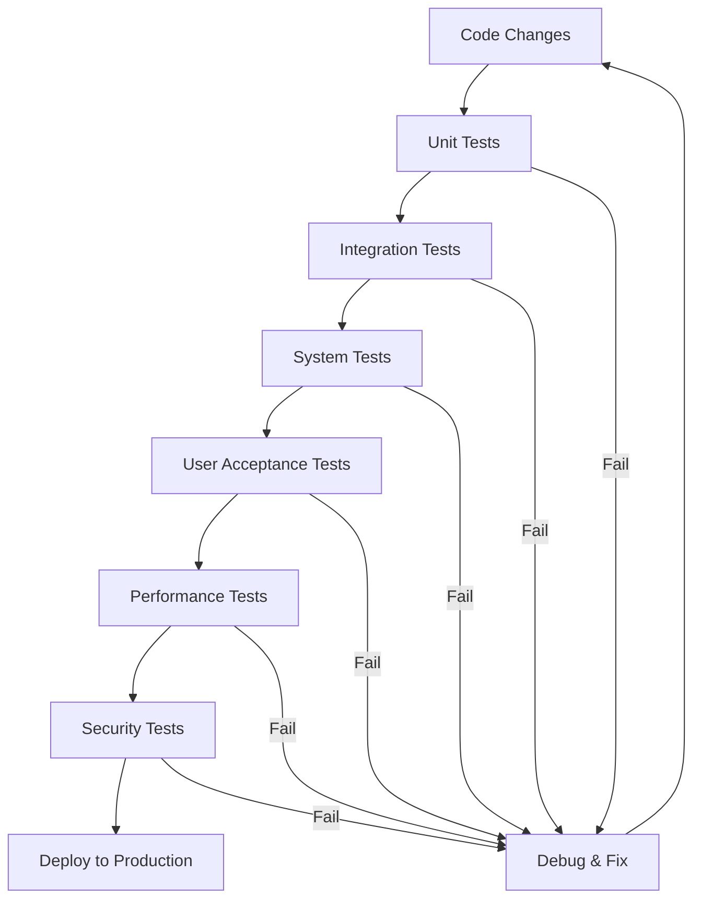

### 5.7 Deployment

#### CI/CD Pipeline
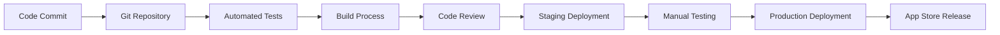

#### Deployment Architecture
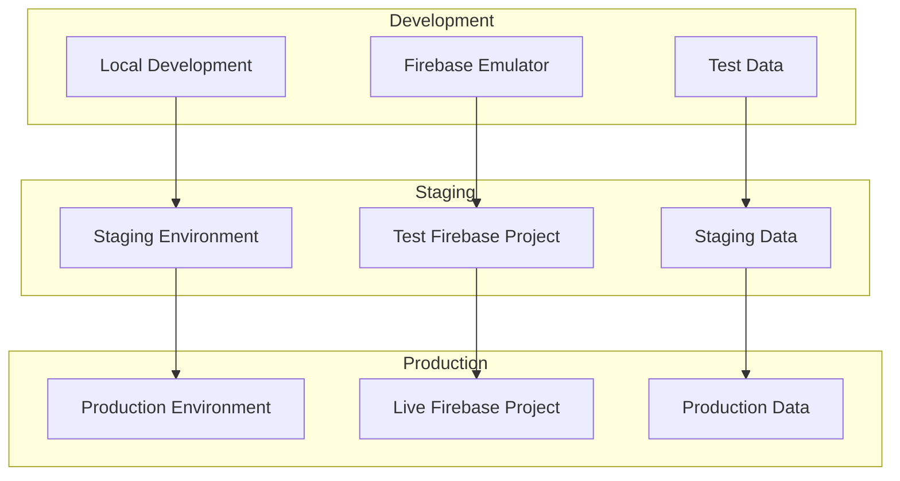

---

## Chapter 6: RESULTS AND TEST

### 6.4 Results of Testing

#### Performance Metrics
```mermaid
graph LR
    A[App Launch Time<br/>2.1 seconds] --> B[Response Time<br/>180ms]
    B --> C[Memory Usage<br/>120MB]
    C --> D[CPU Usage<br/>15%]
    D --> E[Battery Impact<br/>Low]
```

#### Error Rate Analysis
```mermaid
pie
    title Error Distribution
    "Network Errors" : 35
    "Authentication Errors" : 20
    "Data Sync Errors" : 25
    "UI/UX Errors" : 15
    "Other Errors" : 5
```

---

## Chapter 7: CONCLUSIONS AND FUTURE WORK

### 7.2 Future Works

#### Feature Roadmap
```mermaid
gantt
    title SEE App Development Roadmap
    dateFormat  YYYY-MM-DD
    section Phase 1
    Core Features           :done,    des1, 2023-01-01, 2023-06-30
    Basic UI/UX            :done,    des2, 2023-02-01, 2023-05-30
    section Phase 2
    Advanced Analytics     :active,  des3, 2023-07-01, 2023-12-31
    AI Integration         :         des4, 2023-08-01, 2024-02-28
    section Phase 3
    Wearable Integration   :         des5, 2024-03-01, 2024-08-31
    Community Features     :         des6, 2024-06-01, 2024-12-31
```

#### Technology Evolution
```mermaid
graph LR
    A[Current: Flutter + Firebase] --> B[Future: AI + ML]
    B --> C[Advanced Analytics]
    C --> D[Predictive Modeling]
    D --> E[Personalized Interventions]
    E --> F[Wearable Integration]
    F --> G[IoT Ecosystem]
```

---

## Additional Technical Diagrams

### API Integration Architecture
```mermaid
graph TB
    A[SEE App] --> B[Firebase Services]
    A --> C[Gemini AI API]
    A --> D[Analytics Services]
    
    B --> E[Authentication]
    B --> F[Database]
    B --> G[Storage]
    B --> H[Messaging]
    
    C --> I[Emotion Analysis]
    C --> J[Content Generation]
    C --> K[Personalized Suggestions]
    
    D --> L[User Behavior]
    D --> M[Performance Metrics]
    D --> N[Error Tracking]
```

### Security Architecture
```mermaid
graph TD
    A[User Input] --> B[Input Validation]
    B --> C[Authentication Layer]
    C --> D[Authorization Layer]
    D --> E[Data Encryption]
    E --> F[Secure Storage]
    
    G[Network Traffic] --> H[HTTPS/TLS]
    H --> I[API Gateway]
    I --> J[Rate Limiting]
    J --> K[Request Processing]
    
    L[Data Access] --> M[Role-Based Access]
    M --> N[Audit Logging]
    N --> O[Compliance Monitoring]
```

### Scalability Architecture
```mermaid
graph TB
    subgraph "Load Balancer"
        A[Cloud Load Balancer]
    end
    
    subgraph "Application Layer"
        B[Flutter Web Instance 1]
        C[Flutter Web Instance 2]
        D[Flutter Web Instance N]
    end
    
    subgraph "Database Layer"
        E[Firestore Primary]
        F[Firestore Replicas]
    end
    
    subgraph "Storage Layer"
        G[Firebase Storage]
        H[CDN]
    end
    
    A --> B
    A --> C
    A --> D
    B --> E
    C --> E
    D --> E
    E --> F
    B --> G
    C --> G
    D --> G
    G --> H
```

---

*Note: These diagrams are designed to be rendered using the Mermaid plugin. Each diagram represents the visual elements referenced throughout the PROJECT_REPORT.md file.* 