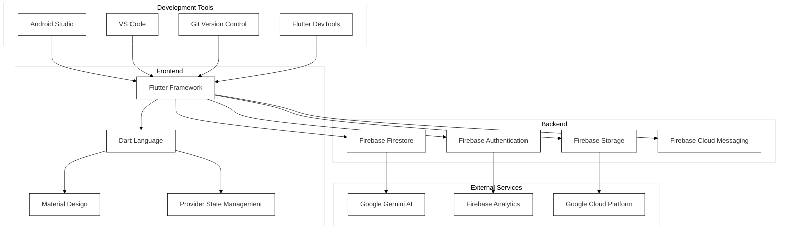
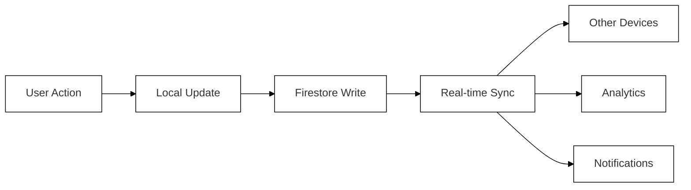
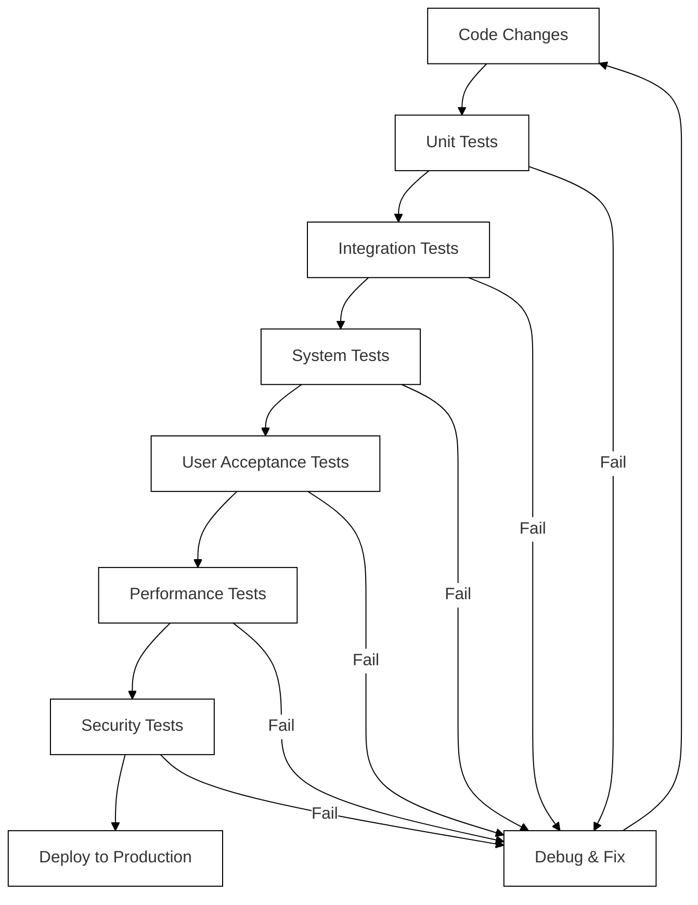
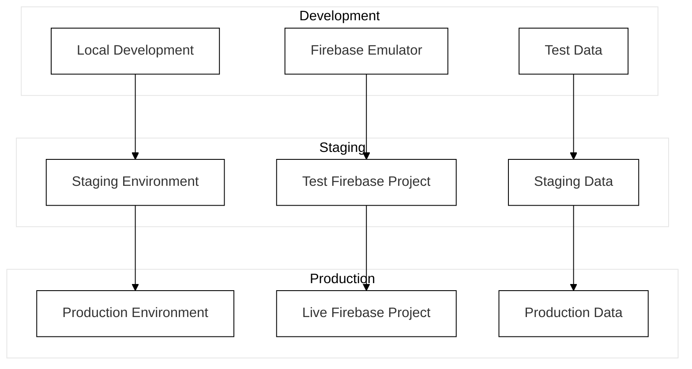
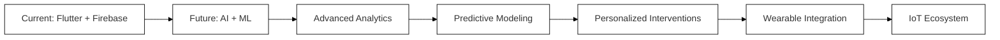
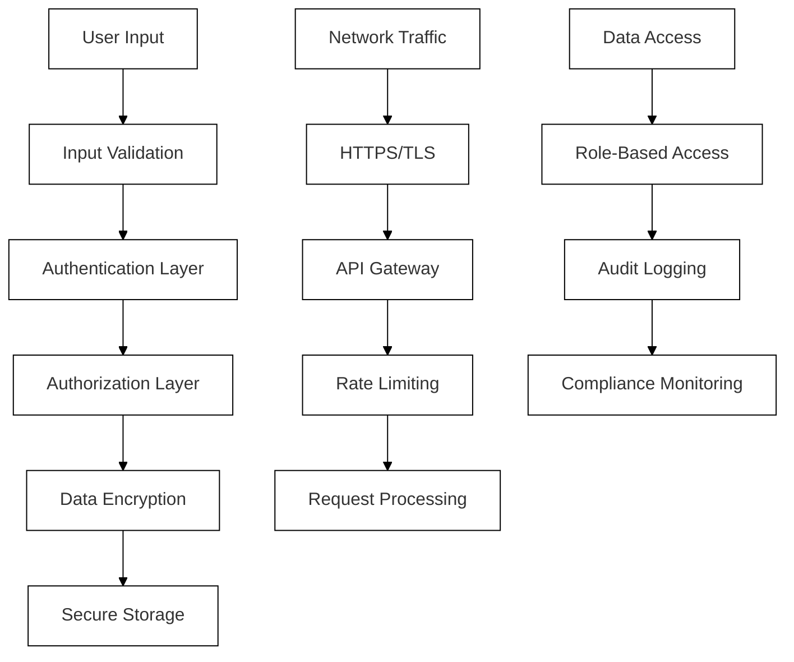
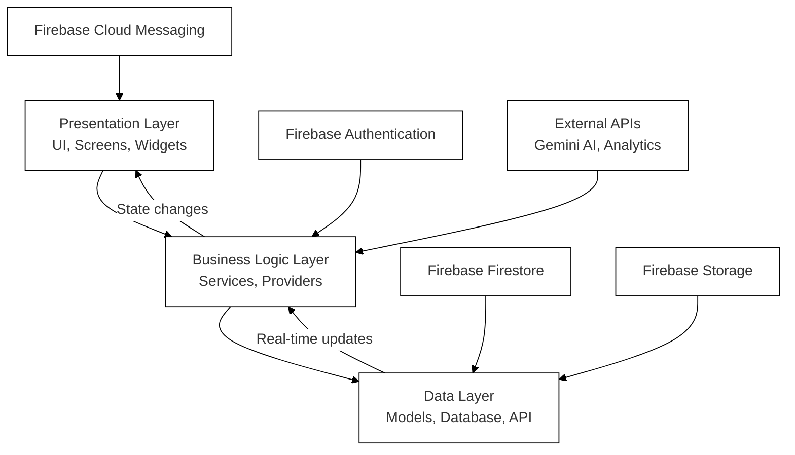
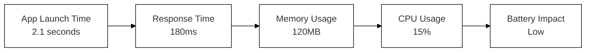

# SEE App Project Diagrams (White Background Compatible)

This file contains redrawn Mermaid diagrams from `PROJECT_DIAGRAMS.md` to ensure they are visible on a white background. I have applied a theme to each diagram to enforce black text, lines, and borders against a white fill.

---

## Figure 1: Technology Stack Architecture

---

## Figure 3: Real-time data synchronization flow

---

## Figure 4: Comprehensive testing strategy

---

## Figure 5 & 8: Continuous Integration and Continuous Deployment pipeline / Release management workflow

```mermaid
%%{init: {'theme': 'base', 'themeVariables': { 'primaryColor': '#ffffff', 'primaryBorderColor': '#000000', 'lineColor': '#000000'}}}%%
graph LR
    A[Code Commit] --> B[Git Repository]
    B --> C[Automated Tests]
    C --> D[Build Process]
    D --> E[Code Review]
    E --> F[Staging Deployment]
    F --> G[Manual Testing]
    G --> H[Production Deployment]
    H --> I[App Store Release]
```

---

## Figure 7: Environment configuration management

---

## Figure 11: Technology Evolution Roadmap

---

## Figure 12: Security measures implemented to protect user data

---

## Figure 13: High-Level Architecture of the SEE App

---

## Figure 9: Response time for critical user interactions

